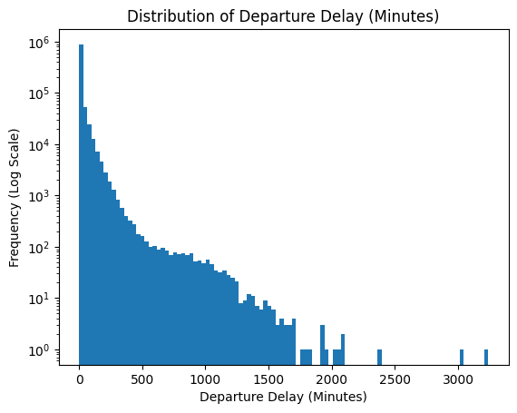
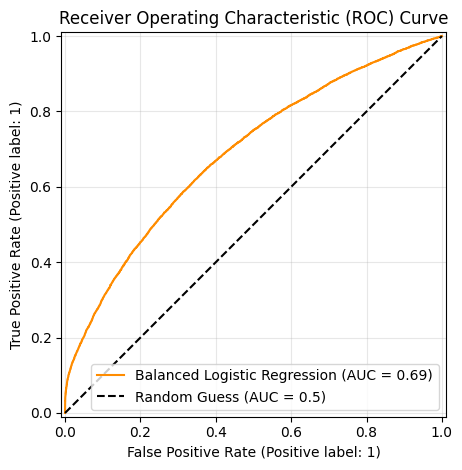
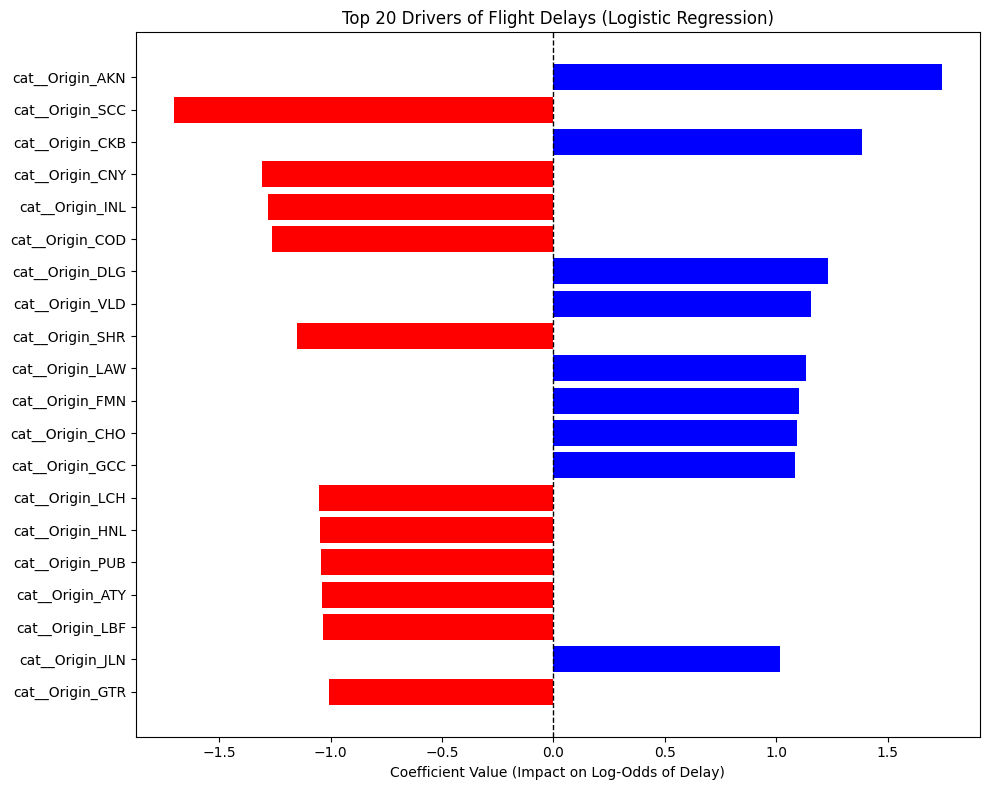

# Final Project Polished Analysis: Predictors of U.S. Domestic Flight Delays (2020-2025)

## Background and Research Question

Likely, at some point in your life, you have been frustrated by a flight delay. Maybe it made you late for a wedding or an important conference, or maybe it just sucked waiting in the airport aimlessly. In 2023 alone, over 3 million passengers flew daily in the United States according to the FAA (1). Many of these passengers experience delays; whether big or small, these can be extremely frustrating. Not only are delays hard for passengers, they also are also costly for airlines in time and resources. 

People often blame weather, airlines, and seasonality for delays. However, assuming a single airline or factor is always to blame is often naive.

 This leads to the core research question: What factors most strongly influence the probability and severity of flight delays in the U.S., and how do these effects vary across airports, airlines, and seasons? 
 
 Answering this question provides valuable insight into the systemic factors driving delays for both consumers and airline operations.

### Hypothesis:

 - H1: Weather significantly increases the probability of flight delay, but its impact is disproportionately concentrated in severe delays rather than mild delays.

 - H2: Taxi-out time (used as a proxy for airport congestion) has a stronger independent effect on delay probability than seasonal variation alone.

 - H3: The effect of departure hour on delay probability is amplified in the Summer relative to the Winter.

 - H4: After controlling for operational factors such as taxi-out time and departure hour, airline identity remains a statistically significant predictor of delay probability.

 - H5: Weather-related delay severity is greater at smaller regional airports than at major hub airports, reflecting geographic and infrastructure heterogeneity.

Note: this analysis focuses on explaining variation in delay probability and severity using statistical modeling rather than purely predictive machine learning.

## Data and Methology

This analysis uses the Bureau of Transportation Statistics (BTS) Airline On-Time Performance dataset from January 2020 through November 2025. After cleaning, the dataset contains approximately 36.3 million domestic flights.

Airport latitude and longitude data were merged from the OpenFlights airports-extended dataset in order to support geographic visualization.

### Data Cleaning

The original dataset consisted of 71 monthly CSV files totaling approximately 17 GB. These were combined into a single master dataset using DuckDB, then converted into a cleaned Parquet file for querying and modeling.

Key steps I took were:
 - Cancelled and diverted flights were removed.
 - Removal of flights involving Puerto Rico (PR), U.S. Virgin Islands, and a nonstandard airport code (TT).
 - Selecting relevant opeation and delay-related variables.
 - Modeling airport longitude and latitude data from the OpenFlights airports-extended dataset for geographic visualization.

A flight was defined as "delayed" if either the Arrival Delay or Departure Delay exceeded 15 minutes. Under this definition, 8,023,000 out of 36,367,047 flights were delayed. Delay severity was split into four categories: On time ($\le$ 15 minutes), Mild (15-60 minutes), Moderate (61-180 minutes), and Severe (> 180 minutes).

## Exploratory Data Analysis

### Distribution of Delays

The distribution of departure delays is highly right-skewed and zero-inflated. Most flights depart on time or with minimal delay, while a small fraction experience extremely long delays. Log-scaled histograms confirm a heavy tail structure.

This justifies the choice to model delay as a binary outcome and severity category rather than normally distributed continuous minutes.

### Seasonality

A chi-square test strongly rejects independence between month and delay status ($p < 0.001$), but the effect size is modest (Cramér's V = 0.082).

Delay rates peak in summer months (June and July ≈ 28–29%) and are lowest in early fall (September ≈ 18%). Seasonality exists but is not overwhelmingly strong on its own.

### Airline and Airport Variation

Airline identity shows statistically significant variation in delay probability ($p < 0.001$, Cramér’s V ≈ 0.093). Airport-level variation is also statistically significant but slightly weaker ($p < 0.001$, Cramér’s V ≈ 0.069).

This suggests airline operational practices contribute more to variation than geographic location alone.

## Deep Dive: The Impact of Weather 

Weather-related delays are rare, occurring in approximately 1% of all flights. Across all flights, the average weather delay is just 4.18 minutes. However, when a flight does experience a weather delay, the distribution is strongly right-skewed; the median weather delay jumps to approximately 34 minutes, and the mean to 70 minutes.

This distribution is visible in the following graph:

To understand where these severe delays happen, we can map the average weather delay severity (conditional on weather occurring) across the U.S.

- [Weather Delay Map](https://hudsonpifer1217.github.io/CSC369/FinalProject/visuals/WeatherDelayMap.html)

As the map illustrates, weather impact is highly heterogeneous. The darkest red clusters, indicating the highest average weather delay severity, are not located at massive coastal hubs, but rather at smaller regional airports in mountainous and snow-prone regions (e.g., SUN, GTF, ASE). This suggests that local infrastructure constraints and geographic conditions heavily mediate how disruptive a weather event becomes.

While geography dictates where severe delays happen, seasonality dictates when. While a chi-square test confirms that weather delay frequency varies by month ($p < 0.001$, Cramér's V = 0.042) peaking in the summer. However, a Kruskal-Wallis test reveals that the median severity of those delays does not differ significantly across months ($p = 0.535$). To investigate this interaction between geography and seasonality further, an animated month-by-month map tracks these hotspots over time.

- [Weather Delay Animation By Month Map](https://hudsonpifer1217.github.io/CSC369/FinalProject/visuals/WeatherDelayAnimationMap.html)

The animation reveals two distinct temporal patterns:

 - During winter months, weather delays are widespread, with severity heavily concentrated in the Mountain West and Pacific Northwest.

 - When significant delays occur in the summer months, the hotspots shift primarily to the East Coast.

Ultimately, summer brings more frequent weather disruptions to the network, but the severity of a weather delay—once it occurs—is relatively constant year-round and highly dependent on local airport geography. Mild delays are primarily operational, whereas weather contributes meaningfully to Severe delays, partially supporting H1.

## Multivariate Modeling and Interactions

A logistic regression model was fit to estimate the probability of delay using operational and seasonal variables. To account for the heavy class imbalance inherent in flight delays (where the vast majority of flights are on-time), a balanced class weight parameter was utilized. This adjustment ensured the model did not artificially inflate its accuracy by simply defaulting to predicting flights as "on-time."

### Model Performance and Evaluation

The model achieved an overall accuracy of 64.9% and an ROC-AUC score of 0.688.

As the ROC Curve illustrates, an AUC of 0.688 demonstrates that the model performs significantly better than random chance (represented by the dotted diagonal line) at identifying delayed flights based purely on operational and seasonal metadata, indicating a moderate and statistically robust ability to distinguish between classes.

Because the model was balanced, it successfully captured 61.4% of all actual delays (Recall = 0.614), a significant improvement over standard baseline models. The precision of 33.5% for delayed flights reflects the inherent volatility of airline operations: the model effectively identifies flights with high-risk operational profiles, even if operational buffers occasionally allow some of those high-risk flights to arrive on time. Ultimately, this confirms that the model functions effectively as an explanatory tool to identify systemic delay pressures rather than a strict predictive engine.

### Key Drivers of Delay

To understand the driving factors behind these probabilities, I extracted the coefficients from the balanced logistic regression model. Because the numeric variables were standardized, the coefficients represent the relative impact each feature has on the log-odds of a flight being delayed.

Features extending to the right (blue) actively increase the probability of a delay, whereas features extending to the left (red) decrease it.

Interestingly, while operational factors like taxi-out time are consistent systemic pressures, the model revealed that the most extreme statistical drivers of delay log-odds are specific Origin Airports.

 - Geographic Extremes: The top 20 features are dominated by small, remote regional airports rather than major coastal hubs. For instance, originating from AKN (King Salmon, AK) drastically increases the log-odds of a delay, while originating from SCC (Deadhorse, AK) or CNY (Moab, UT) strongly decreases them.

 - Supporting Regional Heterogeneity: This finding perfectly aligns with the earlier geographic weather analysis. It suggests that at massive hubs, delays are a product of high-volume congestion (a compounding operational issue), whereas at small regional airports, local infrastructure, highly specific weather patterns, and scheduling quirks create extreme, binary outcomes—flights are either highly prone to disruption or strictly buffered against it.

## Interaction Effects

To fully test the remaining hypotheses for statistical significance, formal interaction terms were evaluated using logistic regression in statsmodels. This allowed for an analysis of whether the relationships between variables changed depending on the context:

 - Month × Departure Hour: Interaction modeling shows that the effect of departure hour is amplified in summer months. In July, each additional hour increases delay odds by approximately 12%, compared to ~7% baseline. This supports H3 and demonstrates seasonal amplification of delay accumulation.

 - Weather × Airport Type: To test H5, an interaction between weather effects (WeatherPresent) and airport size (LargeHub) was evaluated. While the model confirmed a massive main effect for the presence of weather (yielding a coefficient of 6.2234 and a p-value of 0.000), the interaction term itself (WeatherPresent:LargeHub) yielded a p-value of 0.296. Because this is well above the standard 0.05 threshold for significance, testing whether weather effects differ between large hubs and smaller airports shows no statistically significant interaction in the binary delay model. Thus, H5 is not strongly supported in terms of delay probability, although severity heterogeneity exists descriptively.

Synthesizing the initial exploratory data analysis (using Cramér’s V) and the final regression coefficients, the relative strengths of the main delay predictors can be summarized as follows:

| Factor | Relative Strength |
|--------|-------------------|
| Origin Airport | Very Strong (Extremes at small regional airports) |
| Departure Hour | Strong |
| TaxiOut Time | Strong |
| Airline | Moderate |
| Month / Seasonality | Small–Moderate |
| Weather (Probability) | Strong for Severe delays, Weak for Mild delays |

Ultimately, while severe weather events create the most disruptive individual delays, day-to-day operational congestion (taxi-out) and network cascading (departure timing) remain the most consistent systemic predictors of delay probability.

## Conclusions

This analysis set out to determine the true drivers of domestic flight delays, pushing past the common assumption that bad weather is the primary culprit. The data reveals a clear divide between what causes a flight to be delayed in the first place, and what causes that delay to become severe.

Looking back at the original hypotheses, the models paint a consistent picture of systemic network strain.

### Operational Strain over Weather (H1 & H2): 

While weather gets the most public blame, it is surprisingly rare, affecting only about 1% of flights. However, when it does occur, it is a massive driver of severe delays (H1). For day-to-day flying, airport congestion—measured through taxi-out time—is a much stronger and more consistent predictor of a flight being delayed than seasonality or weather (H2).

### The Cascading Effect of Time (H3): 

The later in the day a flight departs, the higher the probability of delay. As hypothesized, this compounding effect is significantly worse in the summer months, showing how tight turnaround schedules fail when the network is at peak capacity.

### Airlines Matter (H4): 

Even when holding airport congestion, time of day, and seasonality constant, airline identity remains a statistically significant predictor of delay. This proves that an airline's internal operational practices and scheduling buffers directly impact passenger experience.

### Regional Wildcards (H5): 
The most surprising finding came from the logistic regression model, which identified specific origin airports as the most extreme mathematical drivers of delay probability. While interaction testing showed that weather doesn't fundamentally change the probability of a delay between a large hub and a small airport, the descriptive maps proved that smaller, geographically constrained airports suffer much higher severity when weather strikes.

In short, the U.S. aviation network is a highly sensitive operational system. While severe weather creates the most disruptive individual spikes in delay time, your odds of being delayed are fundamentally driven by where you are flying out of, how long you sit on the tarmac, and how late in the day you decide to travel.

## Limitations

1. The dataset is observational. This prevents prevents us from uncovering strict causal relationships due to the interconnectedness of ariline networks.

2. The "weather delay" metric is an attribution made by the airliens after the fact. It is not a direct meteorological measurement, instead it is the airline's internal categorization of the delay rather than raw physical data like wind speed, visibility, or precipitation.

3. The logistic regression functions as an explanatory tool. Due to the inherent volitility of daily airline operations, I was able to flag flights with high-risk profiles for being delayed, but predicting the outcome of a single flight is very difficult.

Sources:

 - (1) https://www.faa.gov/air_traffic/by_the_numbers 