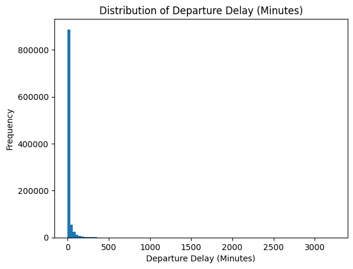

# Final Project Polished Analysis: Predictors of U.S. Domestic Flight Delays (2020-2025)

## Background and Research Question

Likely, at some point in your life, you have been frustrated by a flight delay. Maybe it made you late for a wedding or an important conference, or maybe it just sucked waiting in the airport aimlessly. In 2023 alone, over 3 million passengers flew daily in the United States acording to the FAA (1). Many of these passenenger expereince delays; wether big or small, these can be extremely furstrating. Not only are delays hard for passenegers, they also are also costly for airlines in time and resources. People will often blame weather, airlines, and seasonality for delays. Several times I have said to myself, "I have never been on a United flight that wasn't delayed," on my flight from New York to Cal Poly. However, this is a naive thought.

This leads to my research question: What factors most stronlgy influence the probability and severity of flight delays in the U.S., and how do these effects vary across airports, airlines, and seasons?

I think this question is worth answering because it can help me as a consumer have a better understanding of the factors that lead to delays when traveling by airfair. It can also give me insight into why airliens experience more delays.

### Hypothesis:

 - H1: Weather significantly increases the probability of flight delay, but its impact is disproportionately concentrated in severe delays rather than mild delays.

 - H2: Taxi-out time (used as a proxy for airport congestion) has a stronger independent effect on delay probability than seasonal variation alone.

 - H3: The effect of departure hour on delay probability is amplified in the Summer relative to the Winter.

 - H4: After controlling for operational factors such as taxi-out time and departure hour, airline identity remains a statistically significant predictor of delay probability.

 - H5: Weather-related delay severity is greater at smaller regional airports than at major hub airports, reflecting geographic and infrastructure heterogeneity.

This analysis focuses on explaining variation in delay probability and severity using statistical modeling rather than purely predictive machine learning.

## Data

This analysis uses the Bureau of Transportation Statistics (BTS) Airline On-Time Performance dataset from January 2020 through November 2025. After cleaning, the dataset contains approximately 36.3 million domestic flights.

Airport latitude and longitude data were merged from the OpenFlights airports-extended dataset in order to support geographic visualization.

### Data Cleaning

The original dataset consisted of 71 monthly CSV files totaling approximately 17 GB. These were combined into a single master dataset using DuckDB, then converted into a cleaned Parquet file for querying and modeling.

Key steps I took were:
 - Cancelled and diverted flights were removed.
 - Removal of flights involving Puerto Rico (PR), U.S. Virgin Islands, and a nonstandard airport code (TT)
 - Selection or relevant opeation and delay-related variables

Then a flight was defined as "delayed" if:
> Arrival Delay > 15 minutes or 
> Departure Delay > 15 minutes

Using this definition, I found 8,023,000 out of 36,367,047 flights were delayed in this time period.

Then to analyze magnitude, delay severity was split into four categories: 
 - On time: $\leq 15$ minutes
 - Mild: 15 - 60 minutes
 - Moderate: 61 - 180 minutes
 - Severe: > 180 minutes

## Exploratory Data Analysis

### Distribution of Delays

The distribution of departure delays is highly right-skewed and zero-inflated. Most flights depart on time or with minimal delay, while a small fraction experience extremely long delays. Log-scaled histograms confirm a heavy tail structure.

This justifies modeling delay both as a binary outcome and as a severity category rather than treating delay minutes as normally distributed.

### Seasonality

A chi-square test of independence between month and delay status strongly rejects independence (p $\lt$ 0.001). However, Cramer’s V = 0.082 indicates that the effect size is modest.

Delay rates peak in summer months (June and July ≈ 28–29%) and are lowest in early fall (September ≈ 18%). Seasonality exists but is not overwhelmingly strong on its own.

### Airline and Airport Variation

Airline identity shows statistically significant variation in delay probability (Cramér’s V ≈ 0.093). Airport-level variation is also statistically significant but slightly weaker (Cramér’s V ≈ 0.069).

This suggests airline operational practices contribute more to variation than geographic location alone.

## Weather Analysis

### Frequency

Weather-related delays occur in approximately 1% of flights.

### Severity

Among flights where weather delay occurs:

 - Median weather delay ≈ 34 minutes

 - Mean weather delay ≈ 70 minutes

This confirms that weather delays are rare but substantial.

Sources:

 - (1) https://www.faa.gov/air_traffic/by_the_numbers 