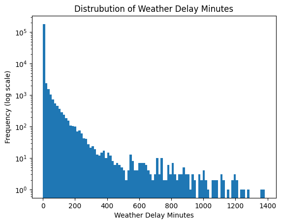
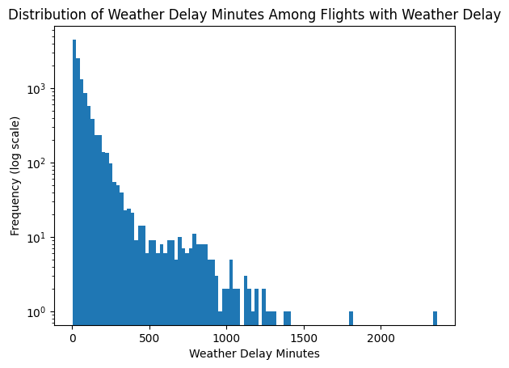
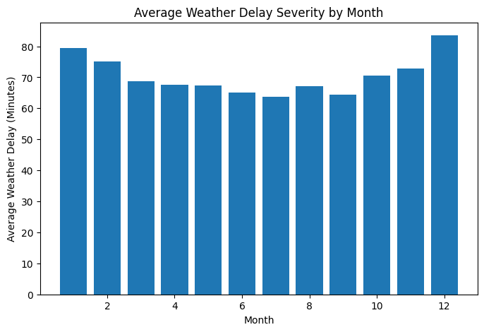

# Final Project Polished Analysis: Predictors of U.S. Domestic Flight Delays (2020-2025)

## Background and Research Question

Likely, at some point in your life, you have been frustrated by a flight delay. Maybe it made you late for a wedding or an important conference, or maybe it just sucked waiting in the airport aimlessly. In 2023 alone, over 3 million passengers flew daily in the United States acording to the FAA (1). Many of these passenenger expereince delays; wether big or small, these can be extremely furstrating. Not only are delays hard for passenegers, they also are also costly for airlines in time and resources. People will often blame weather, airlines, and seasonality for delays. Several times I have said to myself, "I have never been on a United flight that wasn't delayed," on my flight from New York to Cal Poly. However, this is a naive thought.

This leads to my research question: What factors most stronlgy influence the probability and severity of flight delays in the U.S., and how do these effects vary across airports, airlines, and seasons?

I think this question is worth answering because it can help me as a consumer have a better understanding of the factors that lead to delays when traveling by airfair. It can also give me insight into why airliens experience more delays.

### Hypothesis:

 - H1: Weather significantly increases the probability of flight delay, but its impact is disproportionately concentrated in severe delays rather than mild delays.

 - H2: Taxi-out time (used as a proxy for airport congestion) has a stronger independent effect on delay probability than seasonal variation alone.

 - H3: The effect of departure hour on delay probability is amplified in the Summer relative to the Winter.

 - H4: After controlling for operational factors such as taxi-out time and departure hour, airline identity remains a statistically significant predictor of delay probability.

 - H5: Weather-related delay severity is greater at smaller regional airports than at major hub airports, reflecting geographic and infrastructure heterogeneity.

This analysis focuses on explaining variation in delay probability and severity using statistical modeling rather than purely predictive machine learning.

## Data

This analysis uses the Bureau of Transportation Statistics (BTS) Airline On-Time Performance dataset from January 2020 through November 2025. After cleaning, the dataset contains approximately 36.3 million domestic flights.

Airport latitude and longitude data were merged from the OpenFlights airports-extended dataset in order to support geographic visualization.

### Data Cleaning

The original dataset consisted of 71 monthly CSV files totaling approximately 17 GB. These were combined into a single master dataset using DuckDB, then converted into a cleaned Parquet file for querying and modeling.

Key steps I took were:
 - Cancelled and diverted flights were removed.
 - Removal of flights involving Puerto Rico (PR), U.S. Virgin Islands, and a nonstandard airport code (TT)
 - Selection or relevant opeation and delay-related variables

Then a flight was defined as "delayed" if:
> Arrival Delay > 15 minutes or 
> Departure Delay > 15 minutes

Using this definition, I found 8,023,000 out of 36,367,047 flights were delayed in this time period.

Then to analyze magnitude, delay severity was split into four categories: 
 - On time: $\leq 15$ minutes
 - Mild: 15 - 60 minutes
 - Moderate: 61 - 180 minutes
 - Severe: > 180 minutes

## Exploratory Data Analysis

### Distribution of Delays

The distribution of departure delays is highly right-skewed and zero-inflated. Most flights depart on time or with minimal delay, while a small fraction experience extremely long delays. Log-scaled histograms confirm a heavy tail structure.

This justifies modeling delay both as a binary outcome and as a severity category rather than treating delay minutes as normally distributed.

### Seasonality

A chi-square test of independence between month and delay status strongly rejects independence (p $\lt$ 0.001). However, Cramer’s V = 0.082 indicates that the effect size is modest.

Delay rates peak in summer months (June and July ≈ 28–29%) and are lowest in early fall (September ≈ 18%). Seasonality exists but is not overwhelmingly strong on its own.

### Airline and Airport Variation

Airline identity shows statistically significant variation in delay probability (Cramér’s V ≈ 0.093). Airport-level variation is also statistically significant but slightly weaker (Cramér’s V ≈ 0.069).

This suggests airline operational practices contribute more to variation than geographic location alone.

## Weather Analysis

### Frequency

Weather-related delays occur in approximately 1% of flights.

Notice, when we graph the distribution of all flights and their weather delays, the log scaled graph is strongly right skewed.

Among all flights:

 - Median weather delay $= 0$
 - Average weather delay $\approx$ 4.18 minutes

Additionally, when a flight has some weather delay, the distribution is also strongly right skewed.

Among flights where weather delay occurs:

 - Median weather delay $\approx$ 34 minutes

 - Mean weather delay $\approx$ 70 minutes

## Weather and Seasonality

Earlier analysis showed that overall delay probability varies by month, with summer months experiencing higher delay rates. To determine whether this seasonal effect is driven by weather intensity, I tested whether the distribution of weather delay severity differs across months.

Because weather delay minutes are heavily right-skewed and non-normal, I used a nonparametric Kruskal–Wallis test to evaluate whether the median severity differs across months.

The Kruskal–Wallis statistic was 9.95 with a p-value of 0.535.

This result indicates that we fail to reject the null hypothesis that weather delay severity distributions are equal across months. In other words, while overall delay probability varies seasonally, the severity of weather delays (conditional on weather occurring) does not differ significantly by month.

The bar chart below shows a visible dip in average weather delay severity during summer months and higher averages in winter months. However, this variation is small relative to the overall dispersion in weather delay minutes. The seasonal pattern in total delays therefore appears to be driven more by changes in delay frequency than by changes in weather severity when weather occurs.

### Weather and Airport 

To examine geographic variation in weather-related delay severity, I created a map of U.S. airports showing the average weather delay (conditional on weather occurring) at each location.

The map reveals substantial diversity across airport types. Smaller regional airports in mountainous and northern regions exhibit the highest conditional weather delay severity, while large coastal hubs show lower average severity when weather occurs.

This suggests that infrastructure constraints, geographic conditions, and airport capacity likely mediate how disruptive weather events become. Weather does not affect all airports uniformly; instead, its operational impact depends on local context.

- [Weather Delay Map](https://hudsonpifer1217.github.io/CSC369/FinalProject/WeatherDelayMap.html)

To further investigate the interaction between geography and seasonality, I constructed an animated map showing weather delay severity and frequency for each airport month by month (2020–2025).

- [Weather Delay Animation By Month Map](https://hudsonpifer1217.github.io/CSC369/FinalProject/WeatherDelayAnimationMap.html)

Two patterns the animation highlights are:

 - During winter months, weather delays are more frequenty and more severe in the mountain west and pacific north west, but almost every area sees more delays in winter months compared so summer.
 - When there are big delays in summer months, they are primarily on the east coast.

The animation reinforces the conclusion that seasonality affects how often weather disruptions occur, but not necessarily how severe those disruptions are once they occur. Regional heterogeneity remains more pronounced than temporal variation in severity.  

### Weather Delay Frequency and Seasonality

To determine whether weather-related delays occur more frequently in certain months, I conducted a chi-square test of independence between month and the presence of weather delay.

The test strongly rejects independence (χ² = 357.52, p < 0.001), indicating that weather delay frequency varies by month. However, the effect size is small (Cramér’s V = 0.042), suggesting that while the relationship is statistically significant, the magnitude of seasonal variation in weather delay frequency is modest.

Importantly, this seasonal effect on weather frequency is smaller than the seasonal effect observed for overall delay probability (Cramér’s V ≈ 0.082). Additionally, the Kruskal–Wallis test earlier showed that the severity of weather delays (conditional on weather occurring) does not differ significantly across months.

Taken together, these results suggest that while weather-related disruptions occur more frequently in certain months, seasonal variation in overall flight delays is driven more by operational and congestion factors than by changes in weather severity.

### Airport Heterogeneity

Conditional analysis reveals significant heterogeneity across airports. Mountain and snow-prone regional airports (e.g., SUN, GTF, ASE) show the highest average weather delay severity when weather occurs. Major hubs in the Northeast (e.g., EWR, LGA, JFK) also exhibit severe weather amplification.

This demonstrates that weather impact varies geographically and is not uniform across airport types.

### Weather and Delay Magnitude

Severity breakdown shows:

 - Mild delays are primarily operational (carrier, NAS, late aircraft)

 - Severe delays are multi-factor events

 - Weather contributes meaningfully to severe delays but does not dominate exclusively

Thus, H1 is partially supported: weather strongly contributes to severe delays but is not the strongest overall predictor of delay probability.

## Multivariate Modeling

A logistic regression model was fit to estimate the probability of delay using:

 - TaxiOut

 - Departure Hour

 - Month

 - Airline

Key Findings

 - TaxiOut: Each additional minute increases delay odds by ~6%.

 - Departure Hour: Each hour later increases delay odds by ~7–9%.

 - Airline: Significant differences remain after controlling for operational factors.

 - Month: Seasonal effects are statistically significant but smaller in magnitude.

Pseudo R² ≈ 0.085 indicates moderate explanatory power for a noisy operational system.

These results support H2 and H4.

## Interaction Effects

### Month x Departure Hour

Interaction modeling shows that the effect of departure hour is amplified in summer months. In July, each additional hour increases delay odds by approximately 12%, compared to ~7% baseline.

This supports H3 and demonstrates seasonal amplification of delay accumulation.

### Weather × Airport Type

Testing whether weather effects differ between large hubs and smaller airports shows no statistically significant interaction in the binary delay model.

Thus, H5 is not strongly supported in terms of delay probability, although severity heterogeneity exists descriptively.

### Comparative Effect Strength

Using Cramér’s V and regression coefficients:

| Factor | Relative Strength |
|--------|-------------------|
| Departure Hour | Strong |
| TaxiOut | Strong |
| Airline | Moderate |
| Month | Small–Moderate |
| Weather (Probability) | Strong for Severe, Weak for Mild |

Operational congestion and departure timing are the most consistent predictors of delay probability.

## Conclusions

Flight delays are multi-factor events driven primarily by operational congestion and departure timing rather than weather alone. While weather is rare, it is strongly associated with severe disruptions. Airline identity remains a statistically significant predictor even after controlling for operational and seasonal factors.

Interaction analysis reveals that delay accumulation intensifies during peak summer months, but most main effects remain stable across seasons.

Overall, delay probability is best understood as the result of systemic operational pressures rather than isolated weather shocks.

## Limitations

 - The dataset attributes delay causes after the fact and may not fully capture cascading network effects.

 - Weather variables reflect delay attribution rather than meteorological measurements.

 - The model is explanatory rather than fully predictive.

 - Observational data limits causal inference.

Sources:

 - (1) https://www.faa.gov/air_traffic/by_the_numbers 