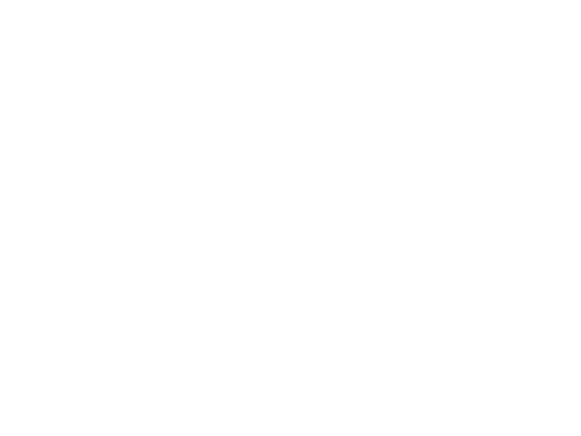

# Initial Draft Writeup: Predictors of U.S. Domestic Flight Delays (2020-2025)

## Reasearch Question & Hypothesis

My project sought to answer the following question:

> What factors most strongly predict flight delays in U.S. domestic air travel, and how do these factors vary by airport and airline?

My initial hypothesis was that weather and airport congestion account for a larger share of delays than airline-specific factors, but the relative importance varies by airport and season.

To do this analysis I used the Bureau of Transportation Statistics – Airline On-Time Performance Data from January 2020 through November 2025, which totalled 36 million flights after cleaning.

## Data Cleaning

I started by downloading the dataset in separate CSV files for each month from 2020-2025. I started with 71 total CSVs that totalled 17 GB. I then combined all the flights into one massive CSV file.

Then I started to clean the data and prepare it for my analysis. 
 - Cancelled and diverted flights were removed.
 - Flights involving Puerto Rico (PR), U.S. Virigin Islands, and a mystery airport called TT were removed

Then I defined a "delay" as:
> Arrival Delay > 15 minutes or 
> Departure Delay > 15 minutes

Using this definition, I found 8,023,000 out of 36,367,047 flights were delaye in this time period.

## Exploratory Analysis

### Distribution of Delays

I initially discovered that the delay distribution is highly skewed to the right.

- Most flights depart on time or within a small delay window.
- A small subset of flights experience extreme delays.
- The delay distribution is heavy-tailed and non-normal.

### Monthly Delay Rate (2020–2025)

Graphing the time series of the flights revealed:

- A sharp drop in delays during mid-2020 (COVID effect) (which was expected)
- Return to higher delay rates post-2021
- Recurring seasonal spikes
- Peaks exceeding 30% in certain months

This suggests:
- Strong seasonality
- Congestion effects

This can be seen in the following graph:

## Major Predictors of Delay

I then sought out to answer my research question by finding what were the strongest predictors of a flight being delayed.

### Seasonality (Month)

Seasonality / month was one of the strongest predictors of a flight being delayed.

The monthly delay rates show a clear seasonal pattern. Summer months experience more delays than the Autum months.

The three months with the highest delay rate were:
 - July: 28.58 %
 - June: 27.7253 %
 - August: 23.91 %

And the three lowest months were:
 - October: 18.52 %
 - November: 18.21 %
 - September: 17.79 %

Clearly the summer months experience more delays. This is likely due to higher passenger volumes, increased congestion, weather problems, or other unknown factors.

### Time of Day

Next I thought to check if the time of day of when a flight leaves can have an impact on if it is delayed. In real life, this would mean an airport or airline gets backed up because of more congestion throughout the day, leading to delays.

I found that departure hour exhibits a clear cascading delay effect:
 - Early morning (5 - 7 am) had the lowest delay rate (~9-12 %)
 - Later in the day (6 - 9 pm) had the highest delay rate (~30 - 31%)
 - Then a slight dorp off late at night

 This pattern relfects system wide congestion accumulation. This result is most visible in this graph:

This is one of the strongest operational signals observed.

### Direction (Eastbound vs. Westbound)

I also wanted to consider whether plans traveling East or West saw more delays.

My original dataset did not include the longitude and latitude of the origin and destination airports.

So I used the OpenFlights dataset of airport locations to find each airports longitude and latitude.

I then classified each flight as either being Eastbound or Westbound:
- When the destination longitude was greater than the origin then the flight was Eastbound
- When the destination longitude was less than the origin then the flight was Westbound

I found:
 - Westbound delay rate: ~22.4%
 - Eastbound delay rate: ~21.6%

This difference is incredibly small, so unfortunately, I can not say a flight going East or West is an indicator of a flight being delayed.

### Airline - Level Variation

Delay rates vary significantly across carriers.

Across all months:
 - Highest delay rates (Frontier (F9), Jetblue (B), Allegiant Air (G4): ~27-30.5%)
 - Lowest delay rates (ExpressJet (EV), Endeavor Air (9E)): ~10–12%

Then I checked the delay rates across airlines after removing peak summer months (June–August):
 - Airlines with higher delay rates saw a 1-2% decrease in delay rates
 - Airlines with lower delay rates saw a 1-2% increase in delay rates, interestingly.

Overall, the airline ranking changed very little, however.

So, airline-level differences persist outside of peak congestion months, suggesting structural operational differences beyond seasonality alone.

## Relative Importance of Factors

Based on magnitude of effect across the factors I investigated, I found the following:
 1. Season (Month): Very strong (~10 percentage points swing)
 2. Time of Day: Very strong (~15–18 percentage points swing from early morning to evening)
 3. Airline: Moderate to strong (~15 percentage points spread across carriers)
 4. Direction: Weak (<1 percetage point difference)

This suggests that system-level congestion and seasonality dominate directional wind effects.

## Hypothesis Evaluation:

My hypothesis was that weather and congestion account for a larger share of delays than airline-specific factors.

I was partially correct in my hypothesis, as congestion was a large factor in whether a flight expereinces a delay. However, weather turned out to be less important than the other factors I analyze. Additionally, airline specific factors like airline company, did explain a large part of differences in delays rates.

The data suggests that delays are primarily driven by network congestion dynamics and seasonal system stress, with airline-level operational practices contributing additional variation.

## Limitations:

 - Airline differences were not adjusted for airport network composition.
 - Weather was not directly merged from meteorological datasets.
 - No multivariate regression model was fit to isolate independent effects.
 - COVID-related structural breaks may influence early-year patterns.

Future work could include logistic regression or gradient boosting to quantify feature importance while controlling for confounders.

## Conclusion:
Flight delays in U.S. domestic travel are driven primarily by:
 - Seasonal system congestion (especially summer)
 - Time-of-day cascading operational effects
 - Airline-level operational differences
 - Directional effects related to east–west travel are minimal.
Overall, congestion and system dynamics dominate wind-direction effects, somewhat supporting my original hypothesis.